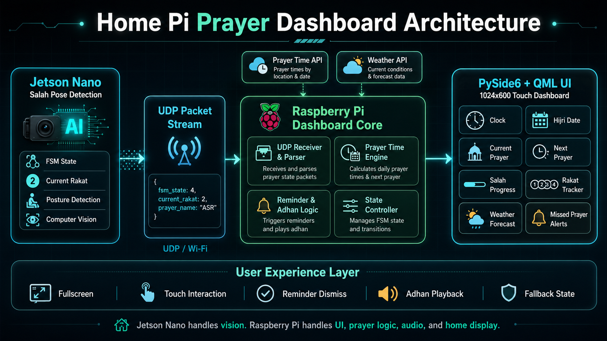
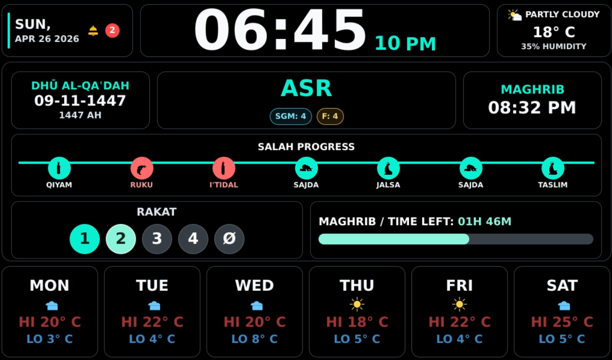

# Home Pi Dashboard

A modular Raspberry Pi 3 home dashboard designed for a 7-inch HDMI display.

## Architecture overview



## Current UI



## Vision

Start with a beautiful full-screen clock and weather panel, then grow into a smart home wall dashboard with modular features.

Planned feature modules:
- clock (phase 1)
- weather (phase 1)
- GPS/location-aware updates (phase 1)
- calendar (phase 2)
- home automation widgets (phase 2)
- prayer/azan and reminders (phase 2)
- local media/news cards (phase 3)

## Stack direction

- Language: Python 3.11+
- GUI strategy: Qt/QML (PySide6) for a clean 1024x600 production layout
- Data services: modular service classes (weather, GPS, time)
- Config: TOML settings + `.env` secrets
- Tests: pytest

The default profile is tuned for Raspberry Pi 3:
- basic Qt render loop
- display-sized wallpaper derivatives instead of full-resolution originals
- optional cached daily wallpaper downloads with local fallback

## Settings-first foundation

The app now supports profile-style settings from `config/settings.toml` (see `config/settings.example.toml`).

Config includes:
- app window/fullscreen sizing
- theme + font family
- background controls
- module toggles (`clock`, `weather`, `gps`)
- refresh intervals per module
- fallback coordinates (defaulted to Hessigheim, Germany)
- performance profile (`rpi3`) and wallpaper/rendering options

Background config now lives in `config/settings.toml` under `[background]`:
- `enabled = true` to show a background image
- `use_daily_image = true` to prefer the daily downloaded wallpaper
- `default_image = "spring.jpg"` to choose the bundled fallback image

If daily image mode is off or the download is unavailable, the dashboard falls back to the configured `default_image`.

Secrets stay in `.env` (for example `WEATHER_API_KEY`).

## Project structure

```text
home-pi-dashboard/
  config/
    settings.example.toml
  docs/
    ARCHITECTURE.md
    ROADMAP.md
  src/homehub/
    main.py
    qml_app.py
    config.py
    modules/
      clock.py
      weather.py
      gps.py
    services/
      weather_service.py
      gps_service.py
    ui/
      seasonal.py
    qml/
      Main.qml
  tests/
    test_config.py
```

## Quick start (local dev)

```bash
python3 -m venv .venv
source .venv/bin/activate
pip install -e .[dev]
cp .env.example .env
cp config/settings.example.toml config/settings.toml
python -m homehub.main
```

## Raspberry Pi 3 One-Step Run

Before first launch on Raspberry Pi OS, install the Qt/X11 runtime packages needed by PySide6:

```bash
sudo apt update
sudo apt install -y libxcb-cursor0 libxkbcommon-x11-0
```

If you see an error like:

```text
qt.qpa.plugin: From 6.5.0, xcb-cursor0 or libxcb-cursor0 is needed to load the Qt xcb platform plugin
qt.qpa.plugin: Could not load the Qt platform plugin "xcb"
```

it means those packages are missing.

On a Raspberry Pi 3 with Raspberry Pi OS 64-bit, you can launch the app with one script:

```bash
cd /path/to/home-pi-dashboard
./scripts/run_on_pi3.sh
```

What this script does:
- creates `.venv` if missing
- installs/updates the dashboard package
- copies `.env.example` to `.env` if needed
- copies `config/settings.example.toml` to `config/settings.toml` if needed
- launches the dashboard

After installation, the Python package also exposes a direct command:

```bash
source .venv/bin/activate
home-pi-dashboard
```

## Raspberry Pi Auto-Update And Restart

If you want the Pi to check `main`, pull updates, stop the running dashboard, and start it again, use:

```bash
cd /path/to/home-pi-dashboard
./scripts/update_and_restart_on_pi.sh
```

What this script does:
- fetches `origin/main`
- compares your local `HEAD` to the remote branch
- if nothing changed and the dashboard is already running, it exits quietly
- if nothing changed and the dashboard is not running, it starts the dashboard
- pulls with `--ff-only` if there is a new commit
- stops the running dashboard process
- restarts it through `./scripts/run_on_pi3.sh`

Important:
- it refuses to auto-pull if you have local tracked changes
- it ignores untracked files, so generated caches do not block updates
- if `DISPLAY` is not set, it defaults to `:0`, which matches most Raspberry Pi desktop sessions

If you want the Pi to check periodically, add a cron entry like this:

```bash
crontab -e
```

Then add:

```cron
*/10 * * * * cd /path/to/home-pi-dashboard && ./scripts/update_and_restart_on_pi.sh >> /path/to/home-pi-dashboard/.runtime/update.log 2>&1
```

That example checks every 10 minutes.

## Raspberry Pi systemd Auto-Run And Auto-Update

If you want this to run automatically in the background on the Pi, install the user-level `systemd` units:

```bash
cd /path/to/home-pi-dashboard
./scripts/install_systemd_user_services.sh
```

What this sets up:
- `home-pi-dashboard.service`
  - keeps the dashboard running
  - restarts it automatically if it exits
- `home-pi-dashboard-update.service`
  - runs the updater script once
- `home-pi-dashboard-update.timer`
  - checks for updates every 10 minutes

Behavior:
- the dashboard starts automatically through `systemd`
- every 10 minutes the timer runs the updater
- if `main` changed, the app is pulled and restarted
- if the app is stopped for any reason, the service brings it back

Useful commands:

```bash
systemctl --user status home-pi-dashboard.service
systemctl --user restart home-pi-dashboard.service
systemctl --user status home-pi-dashboard-update.timer
journalctl --user -u home-pi-dashboard.service -f
```

Notes:
- this is a user-level `systemd` setup, so it works best on a Pi desktop session with your normal user
- it sets `DISPLAY=:0` and `XAUTHORITY=$HOME/.Xauthority` for the GUI service
- the updater script is `systemd`-aware now, so it restarts the managed service cleanly instead of fighting it with manual background processes

## Temporary Adhan Test

If you want to test adhan playback without waiting for the real prayer time, add these lines to `.env`:

```bash
HH_TEST_ADHAN_AFTER_SECONDS=15
HH_TEST_ADHAN_SALAH=Fajr
```

That will:
- wait 15 seconds after app startup
- play the Fajr adhan
- show the post-adhan image for 1 minute after playback finishes

Important:
- this is test-only behavior
- remove or comment these lines again after testing so the dashboard returns to normal prayer-time triggering
- the same keys are included as commented examples in `.env.example`

Important:
- PySide6 works best on Raspberry Pi OS 64-bit
- on 32-bit Pi OS, dependency installation may fail
- if you want kiosk autostart later, we can wire this same launcher into `systemd`
- the Pi launcher now runs the app frameless, and fullscreen is enabled by default in `config/settings.example.toml`

## Raspberry Pi App Install

If you want a simple app-style command and desktop entry on the Pi:

```bash
cd /path/to/home-pi-dashboard
./scripts/install_pi_app.sh
```

This creates:
- `~/.local/bin/home-pi-dashboard`
- `~/.local/share/applications/home-pi-dashboard.desktop`

The salah/prayer-time code is now bundled inside this repository, so the Pi app no longer depends on the separate `azaan_clock` project.

Weather data is fetched live from Open-Meteo and rendered with condition-aware icon styling.
Default style now uses the `crystal` theme and automatic seasonal visuals (spring/summer/autumn/winter).
Real seasonal image assets are stored in `assets/seasonal/` with attribution in `assets/seasonal/ATTRIBUTION.md`.
The app can also fetch one daily seasonal wallpaper from Wikimedia Commons into `assets/seasonal/daily/` (with per-image attribution JSON), then fall back to bundled assets when offline.

## WSL GUI Run Notes

Use the launcher from a normal WSL shell (do not use `sudo`):

```bash
cd /home/user/Workspace/home-pi-dashboard
./scripts/run_dashboard.sh
```

If you see `libEGL`/`MESA`/`Vulkan` warnings in WSL, the app now defaults Qt to software rendering (`QT_QUICK_BACKEND=software` and `QSG_RHI_BACKEND=software`) to keep GUI rendering stable.

If this is your first run:

```bash
cd /home/user/Workspace/home-pi-dashboard
python3 -m venv .venv
source .venv/bin/activate
pip install -e .[dev]
./scripts/run_dashboard.sh
```
